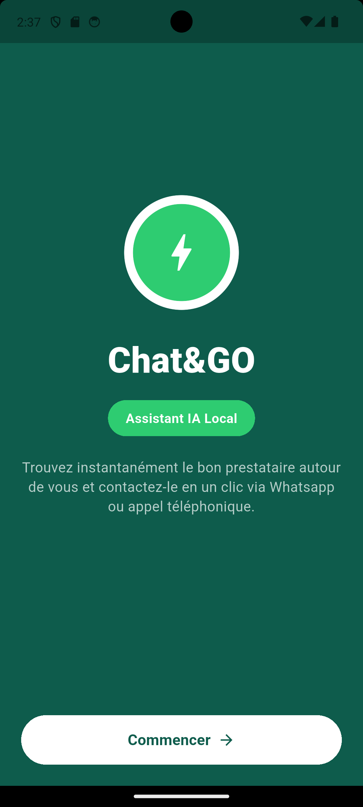
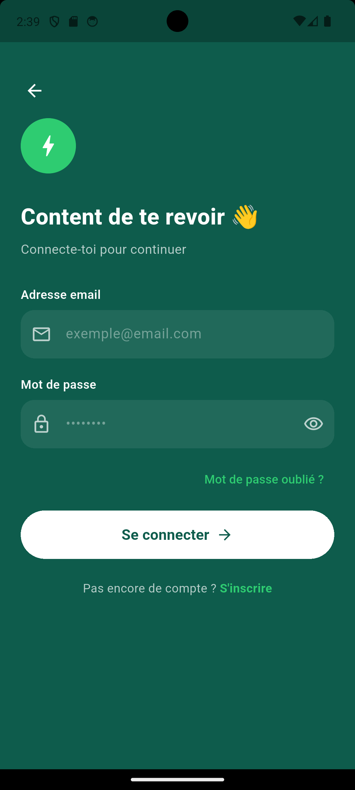
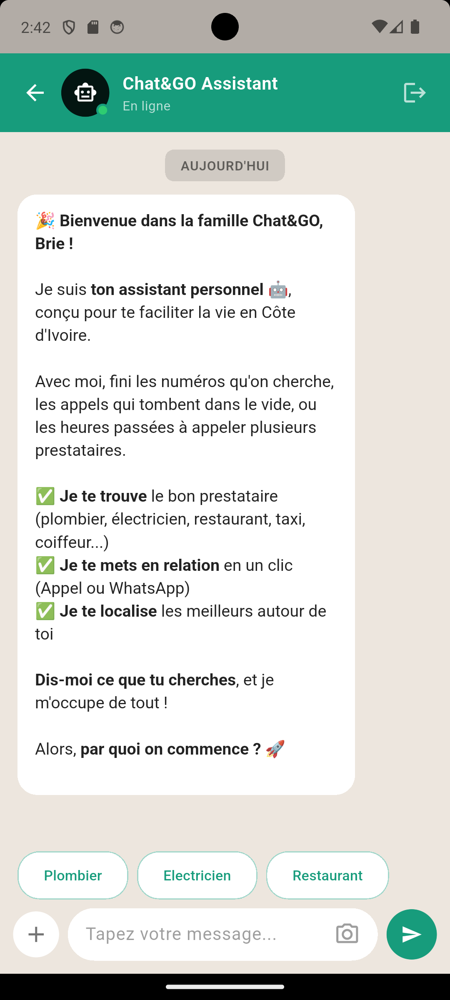
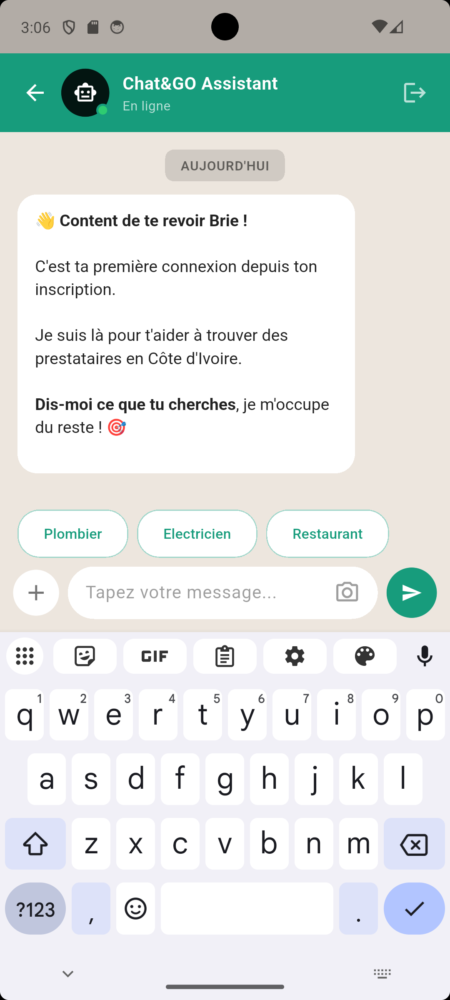
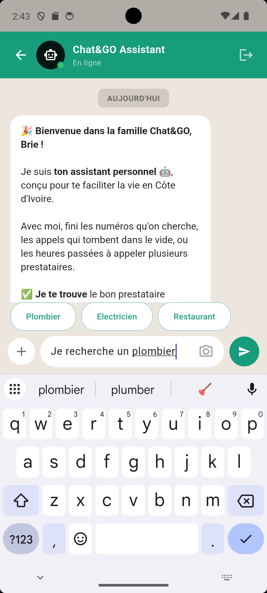
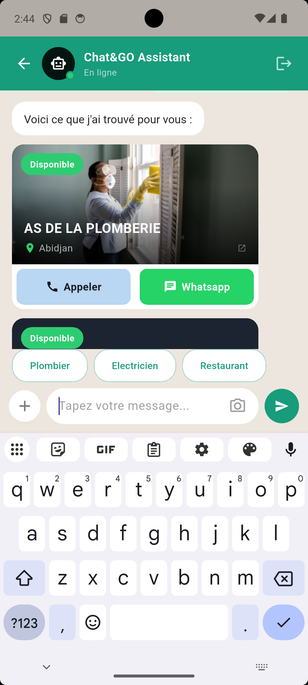
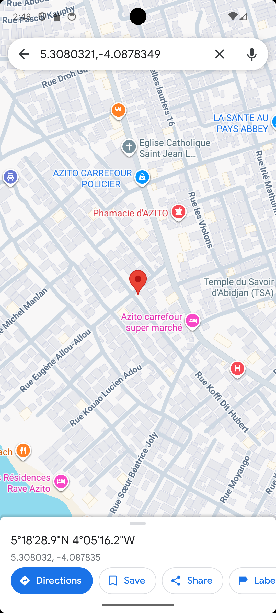

# Chat&Go

Application mobile de **commerce conversationnel**. Son interface reprend les codes graphiques de WhatsApp (bulles de message, structure de chat) pour que l'utilisateur exprime un besoin en langage naturel et soit mis en relation directement avec un prestataire local, par appel ou par WhatsApp.

Projet individuel réalisé par Rosine, dans le cadre de la formation Développeur Data & IA — Simplon Côte d'Ivoire.

## Structure du dépôt

```
.
├── chatgo/     → Application mobile Flutter
└── backend/    → API FastAPI (agent IA + base de données des prestataires)
```

## Fonctionnalités

- Interface de chat façon WhatsApp (bulles, barre de saisie, suggestions rapides)
- Agent IA (DeepSeek) qui comprend la demande et en extrait l'intention
- Recherche de prestataires locaux dans plusieurs catégories : restauration, dépannage, santé, beauté, transport, commerce
- Jusqu'à 3 prestataires proposés par recherche, avec photo réelle quand disponible (recherche en ligne via SerpAPI en secours, enregistrée automatiquement pour la prochaine fois)
- Mise en relation directe : **appel téléphonique** natif, **redirection WhatsApp** avec message pré-rempli, **localisation** cliquable vers Google Maps
- Agent capable de distinguer une vraie demande de service d'une simple conversation (salutations, remerciements), et de répondre chaleureusement sans lancer de recherche inutile

## Architecture

```
Application Flutter (chatgo/)
        |
        |  POST /analyser { "texte": "..." }
        v
Backend FastAPI (backend/)
        |
        |  prompt système + message utilisateur
        v
DeepSeek (extraction d'intention : type, catégorie, mots-clés, ville, urgence)
        |
        v
Recherche dans SQLite (chatgo.db)
        |
        |  si rien trouvé, ou moins de 3 résultats
        v
Recherche en ligne via SerpAPI (Google Maps)
        |
        |  enregistrement automatique des nouveaux résultats
        v
Réponse : intention détectée + liste de prestataires
        |
        v
Affichage des cartes + intents natifs (appel / WhatsApp / localisation)
```

## Installation

### Backend
```bash
cd backend
pip install -r requirements.txt
```
Crée un fichier `.env` dans `backend/` avec :
```
DEEPSEEK_API_KEY=ta_cle_deepseek
SERPAPI_KEY=ta_cle_serpapi
```
Lance le serveur :
```bash
uvicorn main:app --reload
```
La base de données SQLite est créée et ensemencée automatiquement au premier démarrage, aucune étape manuelle n'est nécessaire.

### Application mobile
```bash
cd chatgo
flutter pub get
flutter run
```
Le backend doit tourner en local avant de lancer l'app. `lib/services/api_service.dart` pointe vers `http://10.0.2.2:8000`, l'adresse qui permet à un émulateur Android d'atteindre le PC hôte.

## Technologies

| Côté | Technologies |
|---|---|
| Mobile | Flutter, Dart, http, url_launcher |
| Backend | FastAPI, Uvicorn, SQLite, python-dotenv |
| IA / données | DeepSeek (agent d'intention), SerpAPI (recherche en ligne de secours) |

## Captures d'écran

## Captures d'écran

### 1. Écran de démarrage


### 2. Connexion / Inscription


### 3. Accueil du chat


### 4. Salutation chaleureuse de l'agent IA


### 5. Recherche de prestataires


### 6. Carte avec photo réelle



### 7. Intent natif — Localisation Google Maps


## Endpoints de l'API

### `POST /analyser`
**Requête :**
```json
{ "texte": "je cherche un plombier à Yopougon" }
```
**Réponse :**
```json
{
  "intention": {
    "type": "recherche",
    "categorie": "depannage",
    "mots_cles": ["plombier", "urgence"],
    "ville": "Yopougon",
    "urgence": false,
    "message": null
  },
  "prestataires": [
    {
      "nom": "AS DE LA PLOMBERIE",
      "categorie": "depannage",
      "ville": "Abidjan",
      "telephone": "+225...",
      "latitude": 5.308,
      "longitude": -4.087,
      "photo_url": null,
      "disponible": 1
    }
  ]
}
```
Si l'utilisateur salue ou discute sans exprimer de besoin (`"type": "conversation"`), `prestataires` est vide et `intention.message` contient une réponse chaleureuse à afficher directement.

### `GET /`
Vérification simple que le service est actif.